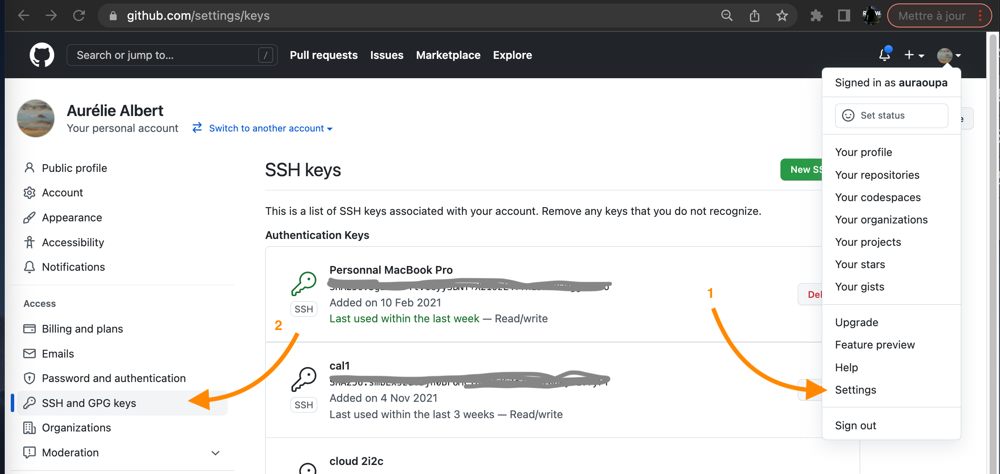

# How to use git and github to back up your work

## Create a project on github
 - create an account on [github](https://github.com) or on [GRICAD's gitlab](https://gricad-gitlab.univ-grenoble-alpes.fr/users/sign_in)
 - create a new repository or project, let's call it **my_work** as an example
 - you can add a description in the README.md file when creating the project
 - you can now add files directly on github/gitlab
 
 
## Add a ssh key for your machine
  - in order to be able to download and upload files to your github account from a specific machine, you have to set up a SSH key as described [here](https://docs.github.com/en/authentication/connecting-to-github-with-ssh)
  - on github, go to your settings and in the SSH and GPG keys section :
  


  - click on add a new key :


  - generate a ssh key by typing the ```ssh-keygen``` command in your terminal, and press enter to all questions, now you have a ```.ssh/id_rsa.pub```  :


  - copy the content of .ssh/id_rsa.pub and paste it in the Key field : 
  


  -  give a title to the key as you. will repeat the operation on every machine you will work on (cal1, dahu, supercomputers, etc ...)

## Clone your project on your machine

  - go back to your **my_work** repository on github and copy the SSH address :


  - on your local machine (the same you use to generate the SSH key) clone your repository :  ```git clone git@github.com:yourgithublogin/my_work.git```
  - a new directory has been created, called my_work and inside you can find the files you added to it on github (README.md and/or other files)


## Save your work on github

  - on your local machine you will start working adding new files to the my_work repository, some notebooks for instance and now you want to save it on github so that it is backed up or you want to show to someone your scripts
  - go to your **my_work** repository locally
  - type these 3 commands :

```
git add yourscript (or * if you wat to add everything you have added)
git commit -m 'some comments about your work like : developping a new param for this'
git push
```
  - go to your **my_work** repository on github : github.com/yourgithublogin/my_work
  - you can see that the files are now also on github and the notebooks' cells content and outputs are rendering like [this one](https://github.com/meom-group/tutos/blob/master/cal1/2020-03-20-AA-demo-dask-dashboard-xarray-on-cal1.ipynb) for instance

## Synchronize your work on multiple machines

  - now you know how to synchronize your work between your machine and github, this can be applied to another machine, like cal1 for instance
  - repeat the steps [Add a ssh key for your machine](#add-a-ssh-key-for-your-machine) and [Clone your project on your machine](#clone-your-project-on-your-machine) described above on this new machine
  - work on this new machine and upload your work to github via steps described in [Save your work on github](#save-your-work-on-github) section
  - if you want to work on the first machine, you need to do a ```git pull``` before adding new files in order to get the changes you've made on the second machine
